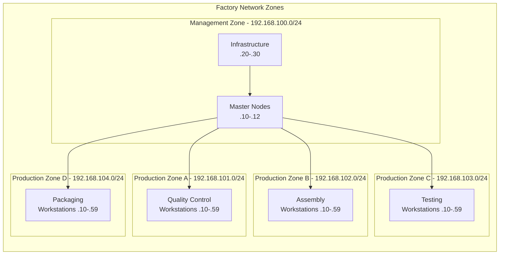
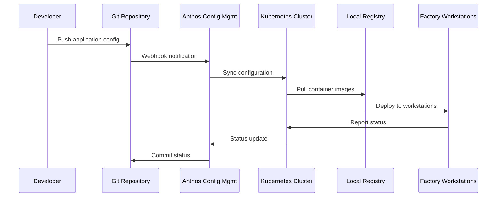

# Zero-Touch Factory Floor Kubernetes

 **Automated Air-Gapped RKE2 Kubernetes Deployment for Manufacturing Environments**

A comprehensive solution for deploying and managing Kubernetes clusters across 200+ manufacturing workstations in air-gapped factory environments. Features automated OS patching with Ansible, local container registry mirrors, Helm chart repositories, and Google Cloud Anthos Config Management for GitOps-driven operations.

##  Table of Contents

- [Overview](#overview)
- [Architecture](#architecture)
- [Features](#features)
- [Prerequisites](#prerequisites)
- [Quick Start](#quick-start)
- [Detailed Setup](#detailed-setup)
- [Configuration](#configuration)
- [Operations](#operations)
- [Monitoring](#monitoring)
- [Troubleshooting](#troubleshooting)
- [Security](#security)
- [Contributing](#contributing)

##  Overview

This project implements a zero-touch Kubernetes deployment solution specifically designed for manufacturing environments where:

- **Air-gapped networks** require offline container registries and package mirrors
- **200+ workstations** across multiple production lines need automated management
- **High availability** and minimal downtime are critical for production operations
- **Compliance and security** requirements mandate strict access controls and audit logging
- **Edge computing** capabilities are needed for real-time quality control and monitoring

### Key Benefits

✅ **Zero-Touch Deployment** - Fully automated cluster provisioning and application deployment  
✅ **Air-Gapped Support** - Complete offline operation with local mirrors and registries  
✅ **Production-Ready** - Battle-tested configurations for manufacturing environments  
✅ **GitOps Integration** - Anthos Config Management for declarative cluster configuration  
✅ **Automated Maintenance** - Scheduled OS patching and application updates with minimal downtime  
✅ **Multi-Line Support** - Isolated production lines with dedicated workstation groups  

##  Architecture

### High-Level Architecture

```mermaid
graph TB
    subgraph "Factory Floor Network (Air-Gapped)"
        subgraph "Control Plane"
            M1[Master Node 1<br/>192.168.100.10]
            M2[Master Node 2<br/>192.168.100.11]
            M3[Master Node 3<br/>192.168.100.12]
            
            M1 -.->|etcd| M2
            M2 -.->|etcd| M3
            M3 -.->|etcd| M1
        end
        
        subgraph "Infrastructure Services"
            REG1[Container Registry 1<br/>192.168.100.20]
            REG2[Container Registry 2<br/>192.168.100.21]
            HELM[Helm Repository<br/>ChartMuseum]
            
            REG1 -.->|sync| REG2
        end
        
        subgraph "Production Line A - Quality Control"
            A1[Workstation A-001<br/>192.168.101.10]
            A2[Workstation A-002<br/>192.168.101.11]
            A50[Workstation A-050<br/>192.168.101.59]
            A1 --> QC[Quality Control App]
            A2 --> QC
            A50 --> QC
        end
        
        subgraph "Production Line B - Assembly"
            B1[Workstation B-001<br/>192.168.102.10]
            B2[Workstation B-002<br/>192.168.102.11]
            B50[Workstation B-050<br/>192.168.102.59]
            B1 --> ASM[Assembly Monitor App]
            B2 --> ASM
            B50 --> ASM
        end
        
        subgraph "Production Line C - Testing"
            C1[Workstation C-001<br/>192.168.103.10]
            C2[Workstation C-002<br/>192.168.103.11]
            C50[Workstation C-050<br/>192.168.103.59]
            C1 --> TEST[Test Automation App]
            C2 --> TEST
            C50 --> TEST
        end
        
        subgraph "Production Line D - Packaging"
            D1[Workstation D-001<br/>192.168.104.10]
            D2[Workstation D-002<br/>192.168.104.11]
            D50[Workstation D-050<br/>192.168.104.59]
            D1 --> PKG[Packaging Automation App]
            D2 --> PKG
            D50 --> PKG
        end
        
        M1 --> A1
        M1 --> B1
        M1 --> C1
        M1 --> D1
        
        REG1 --> M1
        HELM --> M1
    end
    
    subgraph "External (Connected via Secure Gateway)"
        GCP[Google Cloud<br/>Anthos Config Management]
        GITHUB[GitHub<br/>Configuration Repository]
        
        M1 -.->|Config Sync| GCP
        GCP -.->|GitOps| GITHUB
    end
```



### Network Architecture



### Application Deployment Flow



##  Features

###  Automated Deployment
- **Zero-touch provisioning** of 200+ workstations across 4 production lines
- **Parallel deployment** with configurable batch sizes to minimize production impact
- **Health checks and validation** at each deployment stage
- **Rollback capabilities** for failed deployments

###  Air-Gapped Operation
- **Local container registry** with automatic image mirroring and caching
- **Offline Helm chart repository** using ChartMuseum
- **Local package mirrors** for OS updates and software installation
- **Certificate management** for secure inter-node communication

###  Automated Maintenance
- **Scheduled OS patching** during maintenance windows (Sunday 2-6 AM)
- **Rolling updates** with production line isolation
- **Automatic certificate rotation** for security compliance
- **etcd backup automation** with configurable retention policies

###  Monitoring & Observability
- **Real-time cluster monitoring** with Prometheus and Grafana
- **Application metrics** collection from factory floor applications
- **Audit logging** for compliance and security requirements
- **Alerting integration** for critical system events

###  GitOps Integration
- **Anthos Config Management** for declarative cluster configuration
- **Git-based configuration** with automatic sync and validation
- **Policy enforcement** using OPA Gatekeeper
- **Multi-environment support** (dev, staging, production)

##  Prerequisites

### Hardware Requirements

#### Master Nodes (3 nodes minimum)
- **CPU**: 8 cores (Intel Xeon or equivalent)
- **RAM**: 16 GB minimum, 32 GB recommended
- **Storage**: 500 GB SSD (OS + etcd + container images)
- **Network**: Gigabit Ethernet, redundant NICs recommended

#### Worker Nodes (200+ workstations)
- **CPU**: 4 cores minimum (Intel i5 or equivalent)
- **RAM**: 8 GB minimum, 16 GB recommended
- **Storage**: 100 GB SSD (OS + container images + application data)
- **Network**: Gigabit Ethernet
- **Special Hardware**: USB ports for scanners, serial ports for industrial equipment

#### Infrastructure Nodes (2 nodes minimum)
- **CPU**: 4 cores
- **RAM**: 8 GB
- **Storage**: 1 TB SSD (container registry + Helm charts)
- **Network**: Gigabit Ethernet with high bandwidth

### Software Requirements

#### Control Node (where Ansible runs)
```bash
# Ubuntu 20.04+ or RHEL 8+
ansible >= 4.0
python3 >= 3.8
openssh-client
```

#### Target Nodes (all factory workstations)
```bash
# Ubuntu 20.04 LTS or RHEL 8+ (recommended for factory environments)
ssh server enabled
sudo access for deployment user
python3 for Ansible
```

### Network Requirements

- **Isolated factory network** with no internet access (air-gapped)
- **DNS resolution** for local services (or static /etc/hosts entries)
- **NTP synchronization** across all nodes (critical for manufacturing)
- **Firewall rules** configured for Kubernetes networking:
  - 6443/tcp (Kubernetes API)
  - 2379-2380/tcp (etcd)
  - 10250/tcp (kubelet)
  - 30000-32767/tcp (NodePort services)

##  Quick Start

### 1. Clone and Prepare

```bash
# Clone the repository
git clone https://github.com/ruslanbaba/zero-touch-k8s.git
cd zero-touch-k8s

# Make scripts executable
chmod +x scripts/*.sh

# Generate SSH keys for factory access
ssh-keygen -t rsa -b 4096 -f ~/.ssh/factory_rsa -N ""
```

### 2. Configure Inventory

Edit `ansible/inventory.yml` to match your factory network:

```yaml
# Update IP addresses and hostnames for your environment
masters:
  hosts:
    factory-master-01:
      ansible_host: 192.168.100.10  # Your master node IP
    # ... more masters
```

### 3. Distribute SSH Keys

```bash
# Copy SSH key to all factory workstations
./scripts/distribute-ssh-keys.sh
```

### 4. Deploy Factory Cluster

```bash
# Full automated deployment
./scripts/bootstrap-factory-k8s.sh

# Or deploy in phases
./scripts/bootstrap-factory-k8s.sh masters    # Deploy masters first
./scripts/bootstrap-factory-k8s.sh workers   # Then deploy workers
```

### 5. Verify Deployment

```bash
# Export kubeconfig
export KUBECONFIG=./kubeconfig

# Check cluster status
kubectl get nodes -o wide

# Check factory applications
kubectl get pods -n factory-apps

# Check Anthos Config Sync
kubectl get configmanagement -n config-management-system
```

##  Detailed Setup

### Phase 1: Infrastructure Preparation

#### 1.1 Network Setup

Configure your factory network with the following subnets:

```bash
# Management subnet for masters and infrastructure
192.168.100.0/24

# Production line subnets
192.168.101.0/24  # Line A - Quality Control
192.168.102.0/24  # Line B - Assembly  
192.168.103.0/24  # Line C - Testing
192.168.104.0/24  # Line D - Packaging
```

#### 1.2 DNS Configuration

Set up local DNS or configure `/etc/hosts` on all nodes:

```bash
# Master nodes
192.168.100.10  factory-master-01
192.168.100.11  factory-master-02
192.168.100.12  factory-master-03

# Infrastructure services
192.168.100.20  registry-01.factory.local
192.168.100.21  registry-02.factory.local
192.168.100.22  charts.factory.local

# Factory services
192.168.100.30  qc-dashboard.factory.local
192.168.100.31  metrics.factory.local
```

#### 1.3 Time Synchronization

Configure chronyd on all nodes for accurate timekeeping:

```bash
# /etc/chrony/chrony.conf
server 192.168.100.1 iburst  # Local NTP server
driftfile /var/lib/chrony/drift
makestep 1.0 3
rtcsync
```

### Phase 2: Container Registry Setup

#### 2.1 Primary Registry (registry-01)

```bash
# Deploy Docker registry with authentication
docker run -d \
  --name factory-registry \
  --restart=always \
  -p 5000:5000 \
  -v /opt/registry/data:/var/lib/registry \
  -v /opt/registry/certs:/certs \
  -v /opt/registry/auth:/auth \
  -e REGISTRY_HTTP_TLS_CERTIFICATE=/certs/domain.crt \
  -e REGISTRY_HTTP_TLS_KEY=/certs/domain.key \
  -e REGISTRY_AUTH=htpasswd \
  -e REGISTRY_AUTH_HTPASSWD_REALM="Registry Realm" \
  -e REGISTRY_AUTH_HTPASSWD_PATH=/auth/htpasswd \
  registry:2.8
```

#### 2.2 Image Mirroring

```bash
# Mirror essential images for factory operations
./scripts/mirror-factory-images.sh
```

### Phase 3: RKE2 Cluster Deployment

#### 3.1 Master Node Configuration

The first master node bootstraps the cluster:

```yaml
# /etc/rancher/rke2/config.yaml (master-01)
cluster-init: true
token: your-super-secret-token
bind-address: 0.0.0.0
system-default-registry: registry-01.factory.local:5000
disable:
  - servicelb
  - traefik
```

Additional masters join the cluster:

```yaml
# /etc/rancher/rke2/config.yaml (master-02, master-03)
server: https://factory-master-01:9345
token: your-super-secret-token
system-default-registry: registry-01.factory.local:5000
```

#### 3.2 Worker Node Configuration

Factory workstations join as worker nodes:

```yaml
# /etc/rancher/rke2/config.yaml (workers)
server: https://factory-master-01:9345
token: your-super-secret-token
system-default-registry: registry-01.factory.local:5000
node-label:
  - production-line=A  # A, B, C, or D
  - zone=quality-control  # quality-control, assembly, testing, packaging
node-taint:
  - factory-floor=true:NoSchedule
```

### Phase 4: Application Deployment

#### 4.1 Quality Control Applications

Deploy vision inspection and measurement applications:

```bash
kubectl apply -f apps/quality-control-dashboard.yaml
```

#### 4.2 Assembly Line Monitoring

Deploy real-time production monitoring:

```bash
kubectl apply -f apps/assembly-monitor.yaml
```

#### 4.3 Test Automation

Deploy automated testing systems:

```bash
kubectl apply -f apps/test-automation.yaml
```

#### 4.4 Packaging Automation

Deploy packaging and labeling systems:

```bash
kubectl apply -f apps/packaging-automation.yaml
```

### Phase 5: Anthos Config Management

#### 5.1 Install Config Management Operator

```bash
kubectl apply -f https://github.com/GoogleCloudPlatform/anthos-config-management/releases/download/1.15.1/config-management-operator.yaml
```

#### 5.2 Configure Git Repository

```yaml
apiVersion: configmanagement.gke.io/v1
kind: ConfigManagement
metadata:
  name: config-management
spec:
  enableMultiRepo: true
  git:
    syncRepo: "https://github.com/company/factory-k8s-config"
    syncBranch: "main"
    secretType: "ssh"
    syncWait: 15
  policyController:
    enabled: true
    referentialRulesEnabled: true
    logDeniesEnabled: true
```

##  Configuration

### Environment Variables

Configure deployment behavior with environment variables:

```bash
# Deployment configuration
export FACTORY_ENVIRONMENT="production"
export MAINTENANCE_WINDOW="Sunday 02:00-06:00"
export REGISTRY_URL="registry-01.factory.local:5000"
export GIT_CONFIG_REPO="https://github.com/company/factory-k8s-config"

# Security configuration
export ENABLE_AUDIT_LOGGING="true"
export CERTIFICATE_ROTATION_DAYS="90"
export BACKUP_RETENTION_DAYS="30"

# Performance tuning
export MAX_PODS_PER_NODE="50"
export DEPLOYMENT_BATCH_SIZE="10"
export ROLLING_UPDATE_STRATEGY="25%"
```

### Ansible Variables

Customize deployment in `ansible/group_vars/all.yml`:

```yaml
# RKE2 configuration
rke2_version: "v1.28.8+rke2r1"
offline_mode: true
local_registry: "registry-01.factory.local:5000"

# Network configuration
cluster_cidr: "10.42.0.0/16"
service_cidr: "10.43.0.0/16"
cluster_dns: "10.43.0.10"

# Factory-specific settings
production_lines:
  - name: "A"
    zone: "quality-control"
    subnet: "192.168.101.0/24"
  - name: "B"
    zone: "assembly"
    subnet: "192.168.102.0/24"
  - name: "C"
    zone: "testing"
    subnet: "192.168.103.0/24"
  - name: "D"
    zone: "packaging"
    subnet: "192.168.104.0/24"

# Application configuration
factory_apps:
  quality_control:
    image: "factory/quality-control:v1.2.3"
    replicas: 1
    resources:
      requests:
        memory: "256Mi"
        cpu: "200m"
      limits:
        memory: "512Mi"
        cpu: "500m"
```

##  Operations

### Daily Operations

#### Check Cluster Health

```bash
# Overall cluster status
kubectl get nodes
kubectl get pods --all-namespaces

# Factory-specific checks
kubectl get pods -n factory-apps -o wide
kubectl get daemonsets -n factory-apps

# Production line status
for line in A B C D; do
  echo "Production Line $line:"
  kubectl get nodes -l production-line=$line
done
```

#### Monitor Application Performance

```bash
# Resource usage by production line
kubectl top nodes -l production-line=A
kubectl top pods -n factory-apps

# Application logs
kubectl logs -n factory-apps -l app=quality-control --tail=100
```

### Weekly Maintenance

#### OS Patching (Sundays 2-6 AM)

```bash
# Full maintenance cycle
./scripts/maintenance.sh full

# Or patch specific production line
./scripts/maintenance.sh patch-line A
```

#### Certificate Health Check

```bash
# Check certificate expiration
./scripts/check-certificates.sh

# Rotate certificates if needed
./scripts/maintenance.sh rotate-certs
```

### Monthly Operations

#### etcd Backup Verification

```bash
# Create manual backup
./scripts/maintenance.sh backup

# Verify backup integrity
./scripts/verify-backup.sh
```

#### Application Updates

```bash
# Update factory applications
./scripts/maintenance.sh update-apps

# Rollback if needed
kubectl rollout undo daemonset/quality-control -n factory-apps
```

### Emergency Procedures

#### Node Failure Recovery

```bash
# Remove failed node
kubectl delete node <failed-node>

# Re-deploy node
ansible-playbook -i ansible/inventory.yml ansible/site.yml \
  --limit <failed-node> \
  --tags rke2_install,factory_apps
```

#### Registry Failover

```bash
# Switch to secondary registry
ansible all -i ansible/inventory.yml \
  -m lineinfile \
  -a "path=/etc/rancher/rke2/config.yaml regexp='^system-default-registry:' line='system-default-registry: registry-02.factory.local:5000'" \
  --become

# Restart RKE2 services
ansible all -i ansible/inventory.yml \
  -m systemd \
  -a "name=rke2-agent state=restarted" \
  --become
```

##  Monitoring

### Prometheus Metrics

Key metrics to monitor for factory operations:

```promql
# Node availability by production line
up{job="node-exporter", production_line="A"}

# Application pod availability
kube_pod_status_ready{namespace="factory-apps"}

# Quality control processing rate
quality_control_scans_per_minute

# Assembly line throughput
assembly_line_units_per_hour

# Test station success rate
test_automation_success_rate

# Packaging efficiency
packaging_labels_per_minute
```

### Grafana Dashboards

Import pre-configured dashboards:

- **Factory Overview**: Overall production metrics
- **Quality Control**: QC station performance and defect rates
- **Assembly Lines**: Throughput and efficiency metrics
- **Test Automation**: Test results and equipment status
- **Infrastructure**: Kubernetes cluster health

### Alerting Rules

Critical alerts for factory operations:

```yaml
groups:
- name: factory-critical
  rules:
  - alert: ProductionLineDown
    expr: up{job="factory-apps"} == 0
    for: 2m
    labels:
      severity: critical
    annotations:
      summary: "Production line {{ $labels.production_line }} is down"
      
  - alert: QualityControlFailure
    expr: quality_control_defect_rate > 0.05
    for: 5m
    labels:
      severity: warning
    annotations:
      summary: "High defect rate on line {{ $labels.production_line }}"
```

##  Troubleshooting

### Common Issues

#### 1. Node Not Joining Cluster

**Symptoms**: Worker node appears in "NotReady" state

```bash
# Check node logs
journalctl -u rke2-agent -f

# Common causes and solutions
# 1. Network connectivity
ping factory-master-01

# 2. Token mismatch
cat /etc/rancher/rke2/config.yaml

# 3. Registry authentication
crictl pull registry-01.factory.local:5000/rancher/pause:3.6
```

#### 2. Application Pod Stuck in Pending

**Symptoms**: Factory apps not starting on workstations

```bash
# Check pod events
kubectl describe pod <pod-name> -n factory-apps

# Common causes:
# 1. Node selector mismatch
kubectl get nodes --show-labels

# 2. Resource constraints
kubectl describe node <node-name>

# 3. Image pull errors
kubectl get events -n factory-apps --sort-by='.lastTimestamp'
```

#### 3. Registry Connectivity Issues

**Symptoms**: Images failing to pull from local registry

```bash
# Test registry connectivity
curl -k https://registry-01.factory.local:5000/v2/

# Check registry logs
docker logs factory-registry

# Verify certificate trust
openssl s_client -connect registry-01.factory.local:5000 -showcerts
```

#### 4. Anthos Config Sync Failures

**Symptoms**: Configuration not syncing from Git repository

```bash
# Check Config Sync status
kubectl get configmanagement config-management -n config-management-system -o yaml

# Check reconciler logs
kubectl logs -n config-management-system -l app=reconciler-manager

# Force sync
kubectl annotate configmanagement config-management \
  -n config-management-system \
  configmanagement.gke.io/force-sync=$(date +%s)
```

### Performance Tuning

#### 1. Optimize etcd Performance

```yaml
# /etc/rancher/rke2/config.yaml (masters)
etcd-arg:
  - "quota-backend-bytes=8589934592"  # 8GB
  - "max-request-bytes=33554432"      # 32MB
  - "heartbeat-interval=250"
  - "election-timeout=2500"
```

#### 2. Tune Kubelet for Factory Workloads

```yaml
# Factory workstation configuration
kubelet-arg:
  - "max-pods=50"
  - "node-status-update-frequency=10s"
  - "image-gc-high-threshold=80"
  - "image-gc-low-threshold=60"
  - "serialize-image-pulls=false"
```

#### 3. Optimize Network Performance

```bash
# Increase network buffers for high-throughput factory data
echo 'net.core.rmem_max = 67108864' >> /etc/sysctl.conf
echo 'net.core.wmem_max = 67108864' >> /etc/sysctl.conf
echo 'net.ipv4.tcp_rmem = 4096 87380 67108864' >> /etc/sysctl.conf
echo 'net.ipv4.tcp_wmem = 4096 65536 67108864' >> /etc/sysctl.conf
sysctl -p
```

##  Security

### Security Hardening

#### 1. CIS Kubernetes Benchmark Compliance

The cluster is configured with CIS 1.6 profile:

```yaml
# RKE2 server configuration
profile: cis-1.6
protect-kernel-defaults: true
secrets-encryption: true
```

#### 2. Pod Security Standards

```yaml
apiVersion: v1
kind: Namespace
metadata:
  name: factory-apps
  labels:
    pod-security.kubernetes.io/enforce: restricted
    pod-security.kubernetes.io/audit: restricted
    pod-security.kubernetes.io/warn: restricted
```

#### 3. Network Policies

Isolate production lines with network policies:

```yaml
apiVersion: networking.k8s.io/v1
kind: NetworkPolicy
metadata:
  name: production-line-isolation
  namespace: factory-apps
spec:
  podSelector:
    matchLabels:
      production-line: A
  policyTypes:
  - Ingress
  - Egress
  ingress:
  - from:
    - podSelector:
        matchLabels:
          production-line: A
  egress:
  - to:
    - podSelector:
        matchLabels:
          production-line: A
```

#### 4. RBAC Configuration

Minimal permissions for factory applications:

```yaml
apiVersion: rbac.authorization.k8s.io/v1
kind: Role
metadata:
  namespace: factory-apps
  name: factory-app-operator
rules:
- apiGroups: [""]
  resources: ["pods", "configmaps", "secrets"]
  verbs: ["get", "list", "watch"]
- apiGroups: ["apps"]
  resources: ["daemonsets"]
  verbs: ["get", "list", "watch", "update", "patch"]
```

### Audit Logging

Configure audit logging for compliance:

```yaml
# /etc/rancher/rke2/audit-policy.yaml
apiVersion: audit.k8s.io/v1
kind: Policy
rules:
- level: Metadata
  namespaces: ["factory-apps", "factory-monitoring"]
  resources:
  - group: ""
    resources: ["secrets", "configmaps"]
- level: RequestResponse
  resources:
  - group: ""
    resources: ["pods/exec", "pods/portforward"]
```

##  Contributing

 Contributions are welcome to improve the Zero-Touch Factory Floor Kubernetes solution

### Development Setup

```bash
# Clone the repository
git clone https://github.com/ruslanbaba/zero-touch-k8s.git
cd zero-touch-k8s

# Install development dependencies
pip install -r requirements-dev.txt

# Run linting
ansible-lint ansible/
yamllint .

# Run tests
pytest tests/
```

### Contribution Guidelines

1. **Fork the repository** and create a feature branch
2. **Write tests** for new functionality
3. **Update documentation** including README and inline comments
4. **Follow coding standards** using provided linting configurations
5. **Submit a pull request** with detailed description of changes

### Reporting Issues

Please use GitHub Issues for:
-  Bug reports with reproduction steps
- Feature requests with use case descriptions
-  Documentation improvements
-  Questions about deployment or configuration

---


## 🏆 Acknowledgments

- **Rancher Labs** for RKE2 Kubernetes distribution
- **Google Cloud** for Anthos Config Management
- **Ansible Community** for automation frameworks
- **Factory Automation Engineers** for real-world testing and feedback
