# Deployment Architecture

This document provides detailed technical architecture information for the Zero-Touch Factory Floor Kubernetes deployment.

## Network Architecture

### Network Segmentation

The factory floor network is segmented into isolated VLANs for security and performance:

```
┌─────────────────────────────────────────────────────────────────────┐
│                        Factory Network                              │
├─────────────────────────────────────────────────────────────────────┤
│ Management VLAN (192.168.100.0/24)                                 │
│ ├── Master Nodes (.10-.12)                                         │
│ ├── Infrastructure Services (.20-.30)                              │
│ └── Network Management (.1-.9)                                     │
├─────────────────────────────────────────────────────────────────────┤
│ Production VLAN A (192.168.101.0/24) - Quality Control            │
│ └── Workstations (.10-.59)                                         │
├─────────────────────────────────────────────────────────────────────┤
│ Production VLAN B (192.168.102.0/24) - Assembly                   │
│ └── Workstations (.10-.59)                                         │
├─────────────────────────────────────────────────────────────────────┤
│ Production VLAN C (192.168.103.0/24) - Testing                    │
│ └── Workstations (.10-.59)                                         │
├─────────────────────────────────────────────────────────────────────┤
│ Production VLAN D (192.168.104.0/24) - Packaging                  │
│ └── Workstations (.10-.59)                                         │
└─────────────────────────────────────────────────────────────────────┘
```

## Component Architecture

### Control Plane Components

#### Master Nodes (High Availability)
- **3 Master Nodes** for etcd quorum and API server redundancy
- **Load Balancer** distributes API requests across masters
- **etcd Cluster** stores cluster state with automatic backups

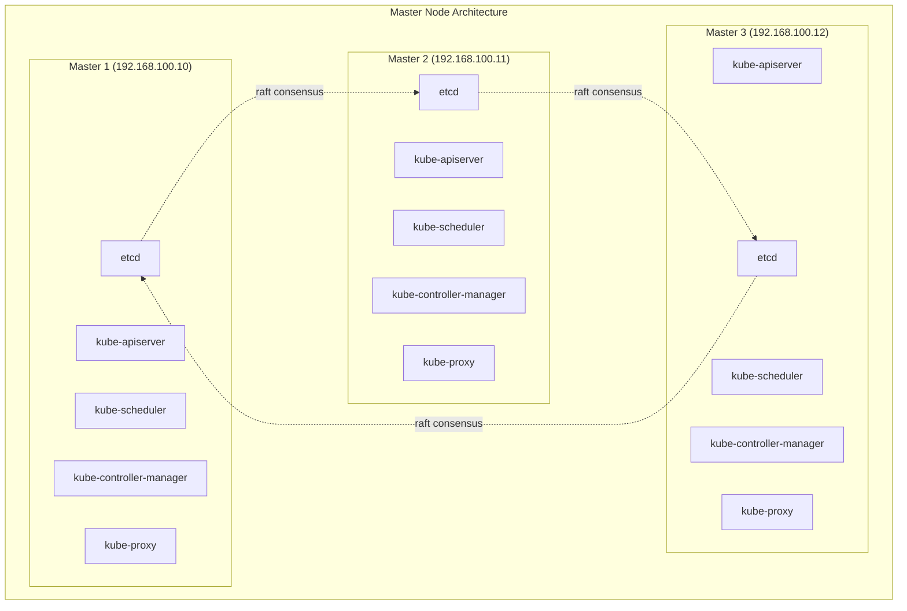

### Infrastructure Services

#### Container Registry Architecture
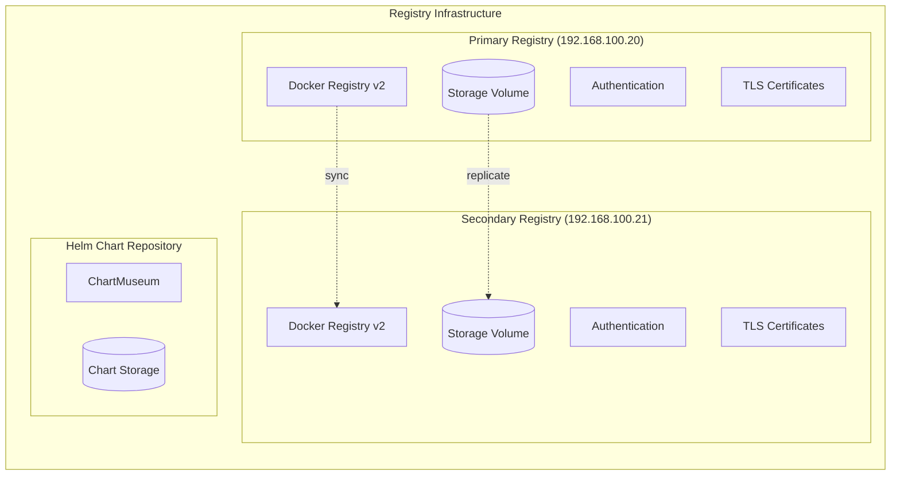

### Application Architecture

#### Factory Application Stack
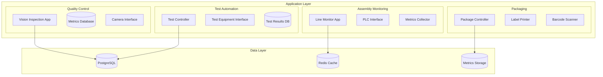

## Data Flow Architecture

### Real-time Data Processing
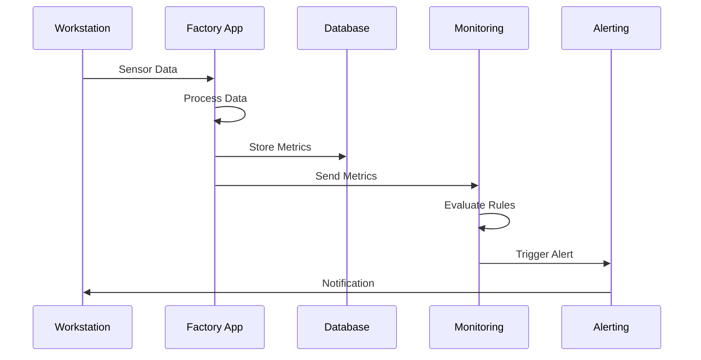

### Configuration Management Flow
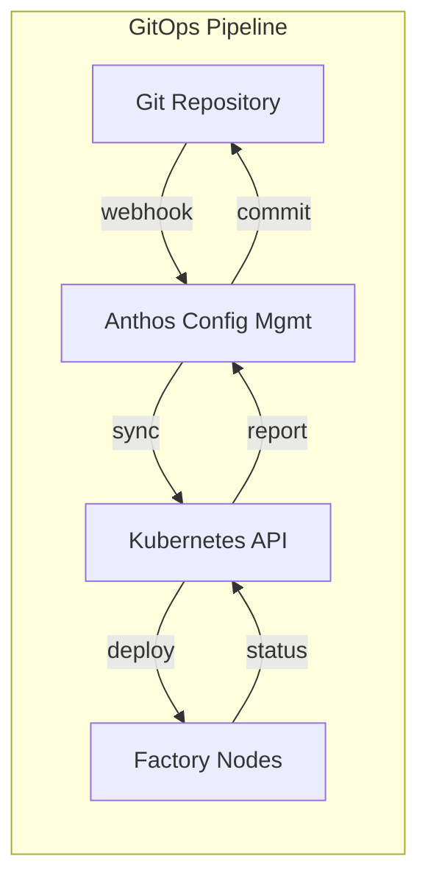

## Security Architecture

### Multi-layer Security Model
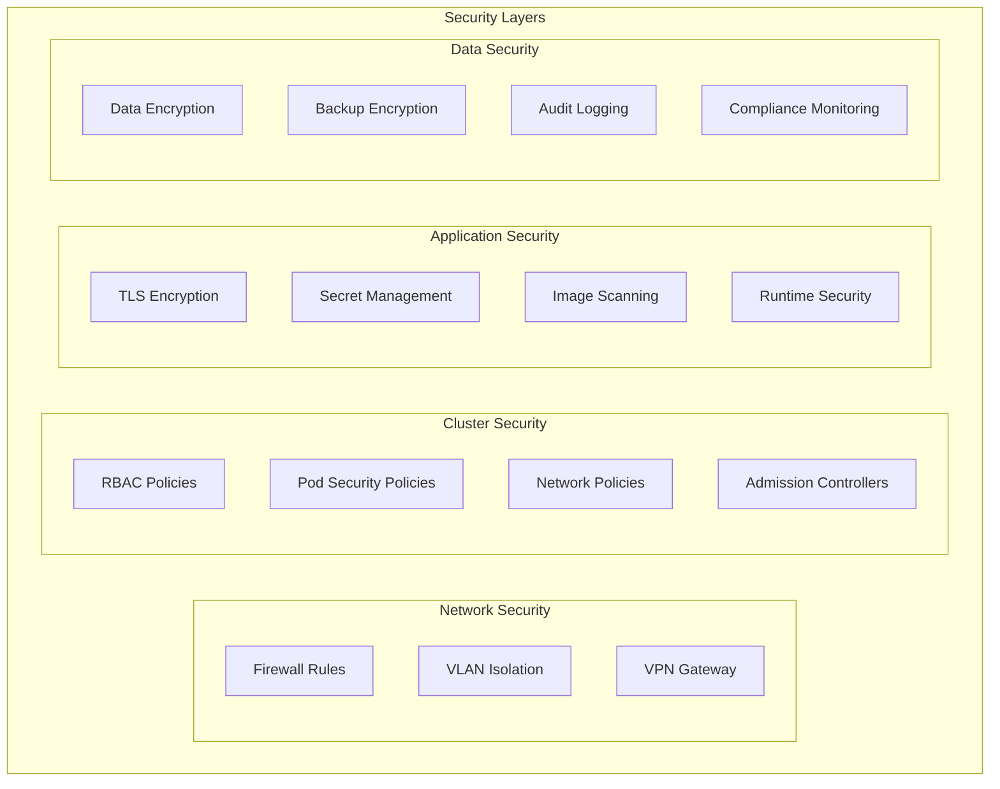

### Certificate Management
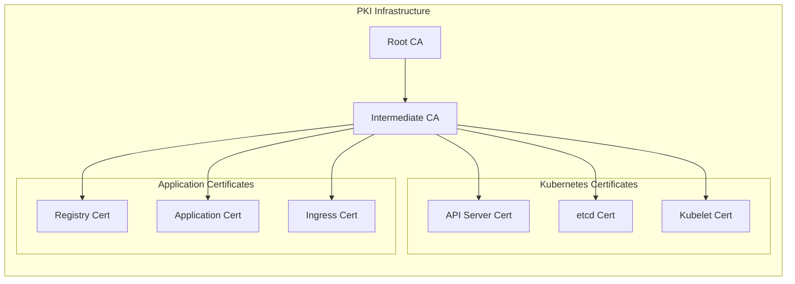

## Scalability Architecture

### Horizontal Scaling Strategy
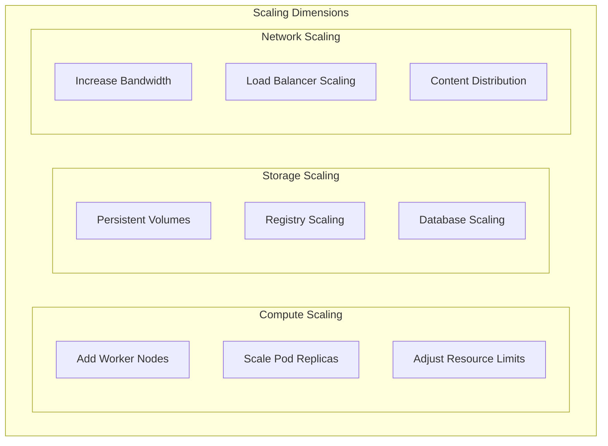

### Performance Optimization
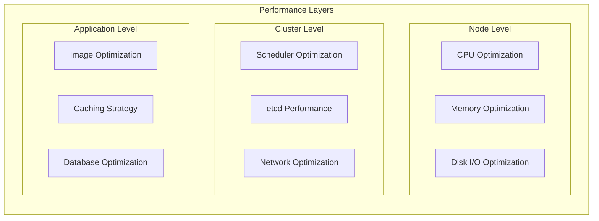

## Disaster Recovery Architecture

### Backup Strategy
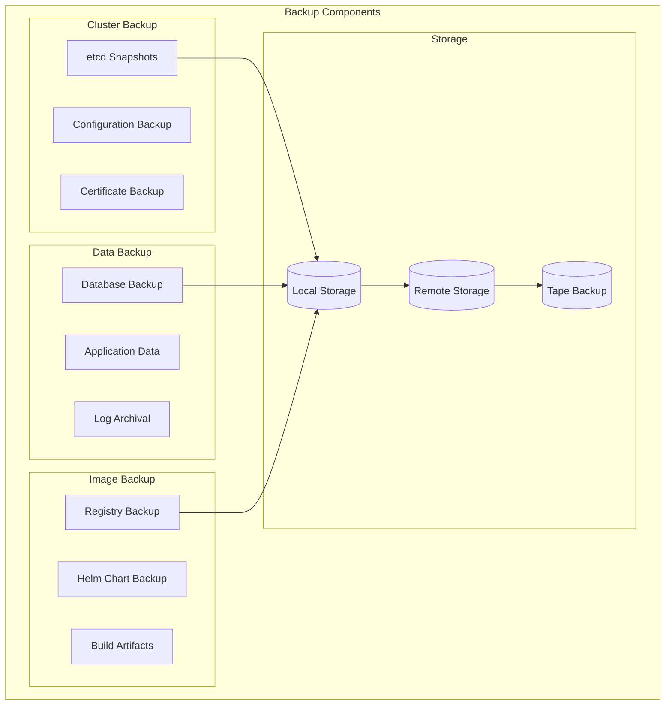

### Recovery Procedures
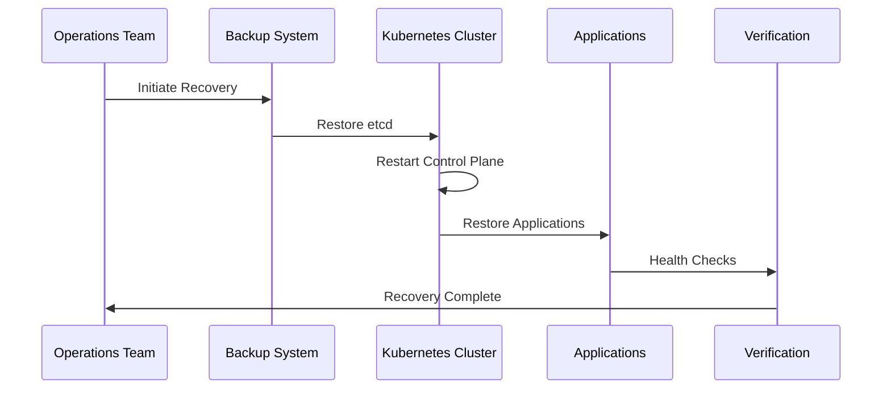

## Monitoring Architecture

### Observability Stack
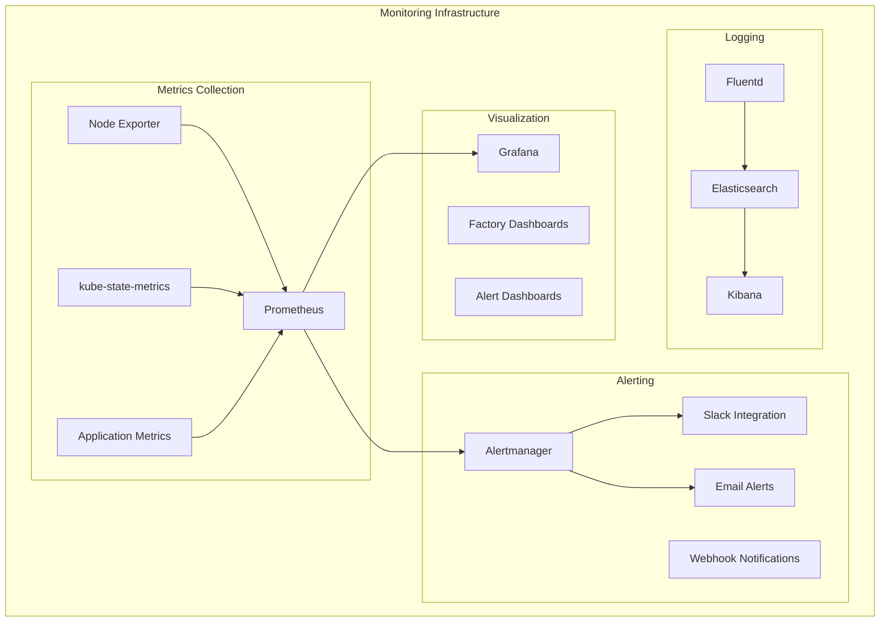

This architecture provides a robust, scalable, and secure foundation for factory floor Kubernetes operations with comprehensive monitoring, backup, and disaster recovery capabilities.
